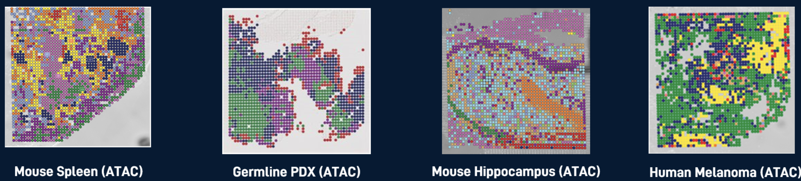
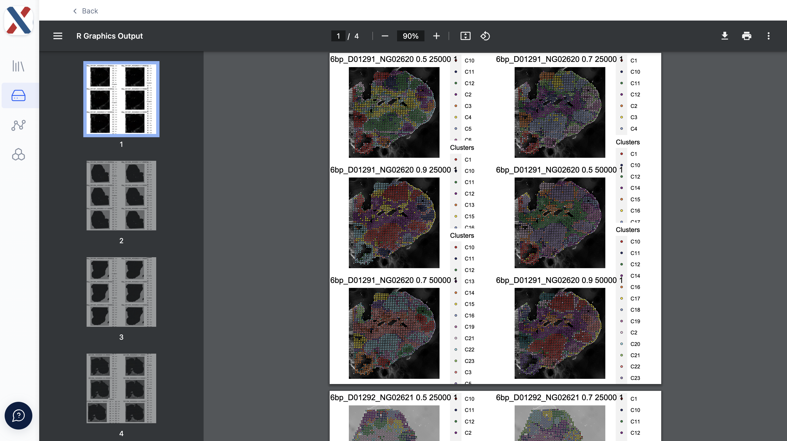

# optimize archr

    

 
 

**optimize archr** is a [latch.bio]() workflow for assessing spatial epigenomic data
generated via [DBiT-seq](https://www.nature.com/articles/s41586-022-05094-1).  Provided fragments from a single-cell ATAC-seq preprocessing and alignment workflow and spatial information, **optimize archr** returns plots and summary statistics to inform further processing.

The workflow utilizes [ArchR](https://www.archrproject.com/articles/Articles/tutorial.html) to generate QC parameters (TSS, fragments per cell) and perform dimensionality reduction/clustering, and [Seurat](https://satijalab.org/seurat/) to spatially align the data.  The workflow can take data from either a single tissue-sample analyzed via DBiT-seq or multiple tissue-samples; in ATX parlance, tissue-samples analyzed via DBIT-seq are termed 'Runs'.  All Runs input to **optimize archr** are merged into a single ArchRProject for analysis.  

## Inputs
All input files for **optimize archr** must be on the latch.bio [file system](https://wiki.latch.bio/wiki/data/overview).  Each run in the workflow takes the following parameters,

* [fragments.tsv.gz file](https://support.10xgenomics.com/single-cell-atac/software/pipelines/latest/output/fragments): A BED-like, tab-delimited file in which each row contains an ATAC-seq fragment

* [tissue_positions_list.csv](https://docs.atlasxomics.com/projects/AtlasXbrowser/en/latest/SpatialFolder.html): A comma-separated file in which each row contains a unique barcode, an indicator for whether the tixel is 'on-tissue' (1, 0), and a row/column index

* [Spatial folder](https://docs.atlasxomics.com/projects/AtlasXbrowser/en/latest/SpatialFolder.html): A directory containing tissue images and experiment metadata

* Run ID: An identifier for the run

* Condition (_optional_):  An experimental Condition descriptor (ie. 'control', 'diseased')

Individual runs are batched in a Project with the following global parameters,

* Project Name: A name for the output folder

* Genome: A reference genome to be used for alignment

* Upload to SLIMS _(ATX-internal only)_: A T/F toggle for whether to push QC results to LIMS

* LSI resolution: A **list** of decimal values used as input to the `clusterParams` parameter of the `addIterativeLSI` function in [ArchR](https://www.archrproject.com/reference/addIterativeLSI.html);

* LSI varFeatures: A **list** of integers used as input to the `varFeatures` parameter of the `addIterativeLSI` function in [ArchR](https://www.archrproject.com/reference/addIterativeLSI.html);

* clustering resolution: A **list** of decimal values used as input to the `resolution` parameter of the `addClusters` function in [ArchR](https://www.archrproject.com/reference/addClusters.html).

> The Project also takes a series of single-value parameters that can be found under the 'Hidden Parameters' dropdown; these parameters are less commonly varied inputs to ArchR functions.

## Running the workflow

The **optimize archr** workflow can be found in the [Workflows](https://wiki.latch.bio/workflows/overview) module in your latch.bio workspace. For access to an ATX-collaborator workspace, please contact your AtlasXomics Support Scientist or email support@atlasxomics.com.  See [here](https://wiki.latch.bio/workflows/overview) for general instructions for running workflows in latch.bio.

1. Navigate to the **optimize archr** workflow in the Workflows module in your latch.bio workspace.  Ensure you are on the 'Parameters' tab of the workflow.

    

2. To add Runs to the Project, select the '+ runs' icon.  Add values for the Run parameters described above; repeat for each Run in the Project.

    

3. Scroll to the bottom of the page and input values for global project parameters.

    

4. Click the 'Hidden Parameters' button and change the global parameters as needed.

5. Click the 'Launch Workflow' button on the bottom-right of the parameters page.  This will automatically navigate you to the Executions tab of the workflow.

6. From the Executions tab, you can view the status of the launched workflow.  Once the workflow has completed running, the status will change to 'Succeeded'; if the workflow has the status 'Failed', please contact an AtlasXomics Support Scientist.  You can click on the workflow execution to view a more granular workflow status and see output logs.

7. Workflow outputs are loaded into the latch.bio [Data module](https://wiki.latch.bio/wiki/data/overview) in the `optimize_outs` directory.

## Outputs

Outputs from **optimize archr** are loaded into latch.bio [Data module](https://wiki.latch.bio/wiki/data/overview) in the `optimize_outs` directory.

    

The workflow outputs four files:

* medians.csv: A common-separated file containing median TSS and median fragment count values for on-tissue tixels for each Run in the Project

* qc_plots.pdf: A PDF containing heat-maps for the fragment count (log10) and TSS Enrichment Score for each 'on-tissue' tixel, overlaid on top of the tissue image

    

* umap_plots.pdf: A PDF containing [UMAP plots](https://www.archrproject.com/articles/Articles/tutorial.html#visualizing-in-a-2d-umap-embedding) colored by Run ID and cluster assignment. **optimize archr** generates a two UMAP plots for each element in the Cartesian product of the **LSI resolution**, **LSI varFeatures**, and **clustering resolution** parameters.

    

* spatialdim_plots.pdf: A PDF containing Seurat [Spatial Plots](https://satijalab.org/seurat/reference/spatialplot) with tixel cluster-assignment overlaid on top of the tissue image.  For each Run, the workflow generates a Spatial Plot for each element in the Cartesian product of the **LSI resolution**, **LSI varFeatures**, and **clustering resolution** parameters.

    

## Next Steps

The quality of each Run can be evaluated with the TSS Enrichment and Fragment count medians and the qc plots.  If the quality is deemed sufficient for further analysis, the UMAP plots and Spatial Plots can be used to inform dimensionality reduction and clustering in further analysis.  

Analysis can be performed locally or in a latch.bio [Pod](https://wiki.latch.bio/wiki/pods/overview).  For access to ATX-specific Pods, please contact your AtlasXomics Support Scientist.  

Further analysis can also be performed in latch.bio with the **create ArchRProject** (returns ArchRProject with peak and motif calling) and **atlasShiny** (returns inputs for the ATX ATAC-seq R Shiny App).  For access to these workflows, please contact your AtlasXomics Support Scientist.
 

## Support
Questions? Comments?  Contact support@atlasxomics.com or post in AtlasXomics [Discord](https://discord.com/channels/1004748539827597413/1005222888384770108).
